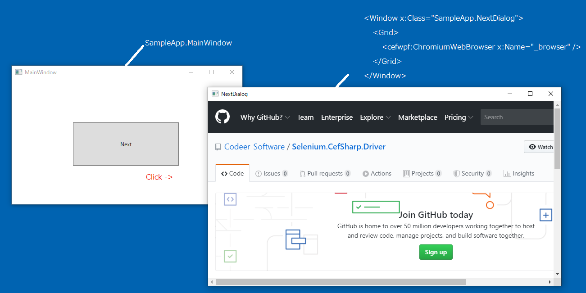

Selenium.CefSharp.Driver_α
======================

<br>
The status of this library is alpha.
<br>

## Features ...
It is a library for operating ChromiumWebBrowser with the interface of Selenium.
Supports WinForms & WPF.

## Getting Started
Install Selenium.CefSharp.Driver from NuGet

    PM> Install-Package Selenium.CefSharp.Driver
https://www.nuget.org/packages/Selenium.CefSharp.Driver/

# What problem can this solve?
Chrome driver is able to manipulate apps that are configured only with CefSharp, but it can't manipulate apps that used CefSharp for only part of it.
This problem will be solved by using CefSharpDriver.

# Another process manuplation.
This library is a layer on top of Friendly, so you must learn that first. But it is very easy to learn.<br>
https://github.com/Codeer-Software/Friendly.Windows

# Sample
https://github.com/Codeer-Software/Selenium.CefSharp.Driver/tree/master/Project/Sample<br>
Sample App.<br>
 

Code.<br>
```cs  
using System.Diagnostics;
using System.IO;
using Codeer.Friendly;
using Codeer.Friendly.Dynamic;
using Codeer.Friendly.Windows;
using Codeer.Friendly.Windows.Grasp;
using Microsoft.VisualStudio.TestTools.UnitTesting;
using OpenQA.Selenium;
using RM.Friendly.WPFStandardControls;
using Selenium.CefSharp.Driver;

namespace SampleTest
{
    [TestClass]
    public class UnitTest
    {
        WindowsAppFriend _app;
        WindowControl _nextDialog;
        string _htmlPath;

        [TestInitialize]
        public void TestInitialize()
        {
            //start process.
            var dir = typeof(UnitTest).Assembly.Location;
            for (int i = 0; i < 4; i++) dir = Path.GetDirectoryName(dir);
            var processPath = Path.Combine(dir, @"SampleApp\bin\x86\Debug\SampleApp.exe");
            var process = Process.Start(processPath);

            //attach by friendly.
            _app = new WindowsAppFriend(process);

            //show next dialog.
            var mainWindow = _app.WaitForIdentifyFromTypeFullName("SampleApp.MainWindow");
            var button = new WPFButtonBase(mainWindow.Dynamic()._buttonNextDialog);
            button.EmulateClick(new Async());

            //get next dialog.
            _nextDialog = _app.WaitForIdentifyFromTypeFullName("SampleApp.NextDialog");

            //test html
            _htmlPath = Path.Combine(dir, @"Controls.html");
        }

        [TestCleanup]
        public void TestCleanup()
            => Process.GetProcessById(_app.ProcessId).Kill();

        [TestMethod]
        public void TestMethod()
        {
            //create driver.
            var driver = new CefSharpDriver(_nextDialog.Dynamic()._browser);

            //manipulate by interface of Selenium.

            //set url.
            driver.Url = _htmlPath;
         
            //find element.
            var buttonTest = driver.FindElement(By.Id("testButton"));

            //click.
            buttonTest.Click();

            //find element.
            var textBoxName = driver.FindElement(By.Id("textBoxName"));

            //sendkeys.
            textBoxName.SendKeys("abc");
        }
    }
}
```


